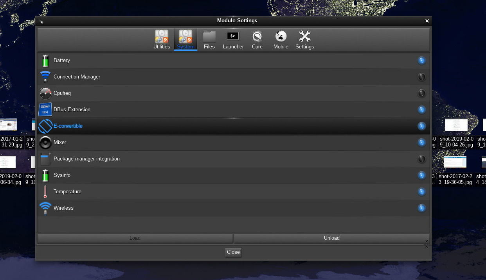
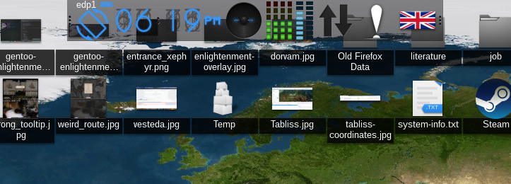

This gadget is meant to improve screen rotation quality by leveraging on [iio-sensor-proxy](https://github.com/hadess/iio-sensor-proxy).
iio-sensor-proxy is a D-Bus proxy for accelerometers and ambient light sensors.

This gadget, merely connect to DBUS and read the information put there by iio-sensor-proxy, provided that the gyroscope is supported.


## Installation
To install it please run:
```bash
meson build --prefix /usr
cd build
ninja 
sudo ninja install
``` 

This will create a gadget in the <prefix>/<lib_folder>/enlightenment/modules
The gadget structure is like the following:

```
modules
|   
|
└───convertible
|   |
|   └───module.desktop
|   └───linux-gnu-x86_64-ver-0.23
|   |   |   # The gadget you compiled
|   |   └───e_gadget_convertible
|   └───e-gadget-covnertible.edj
└───... # Other gadgets
```

## Usage
Once the gadget has been installed, you need to enable the module and add the gadget to your bar.

For completeness, the following picture shows where to enable the module.


Then you should see a new gadget named **convertible**. Add it the your gadget bar.


The main _blue rotating_ icon is clickable. It is meant to lock/unlock the automatic rotation.
When grey, rotation is locked and no matter how you move your convertible, it won't rotate the screen.

When blue, rotation is unlocked and the screen(s) will rotate according to the data coming trough D-Bus

You can see it in action in the following video:
[](https://www.youtube.com/watch?v=X21WxWXol3k "Everything Is AWESOME")